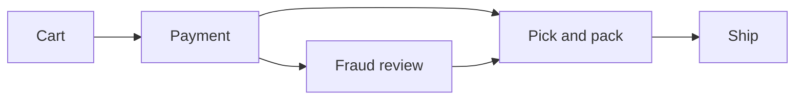
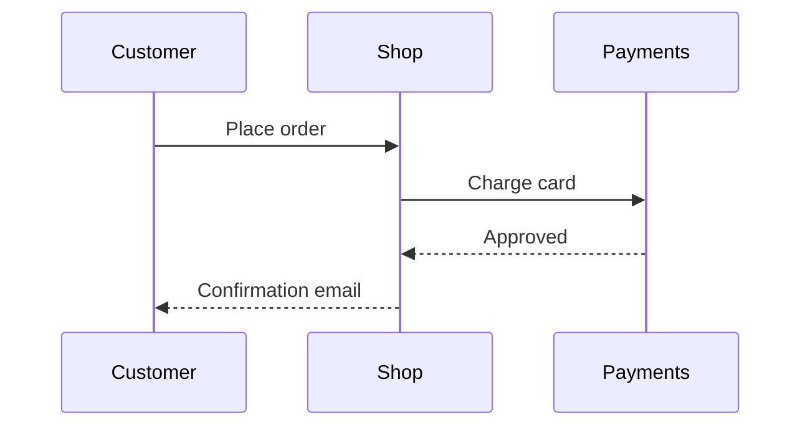

# Rocket Shop: Getting started

Rocket Shop is a fictional storefront used to show what **md-preview** draws: headings, callouts, tables, Mermaid diagrams and tree-sitter highlighted code.

> [!NOTE]
> Everything in this document is made up. It exists to exercise the renderer.

## Overview

Orders move through a short pipeline. Each stage can stop an order and hand it to a person.



## Plans

| Plan | Price | Launches per month | Support |
|:-----|------:|:------------------:|:--------|
| Hobby | 0 | 3 | Community forum |
| Pro | 49 | 50 | Email, next business day |
| Enterprise | Contact us | Unlimited | A named engineer, and a very long note that wraps inside its column to show how rows stay apart |

> [!TIP]
> Start on Hobby. Plans can be changed at any time from the billing page.

## Checkout flow



> [!WARNING]
> Card charges are captured when the order ships, not when it is placed.

## Code

```ts
export async function placeOrder(cart: Cart): Promise<Order> {
  const total = cart.items.reduce((sum, item) => sum + item.price * item.qty, 0)
  if (total <= 0) throw new Error('empty cart') // nothing to charge
  return api.post('/orders', { items: cart.items, total })
}
```

```python
def launch(rocket: str, count: int = 1) -> list[str]:
    """Launch `count` rockets and return their tracking ids."""
    return [f"{rocket}-{n:04d}" for n in range(count)]
```

## Troubleshooting

| Symptom | Likely cause | What to do |
|:--------|:-------------|:-----------|
| Order stuck in *Payment* | Card needs 3-D Secure | Ask the customer to finish the bank's check |
| Tracking id missing | Carrier API was down | Choose **Retry label** on the order |

> [!CAUTION]
> Deleting an order also deletes its invoice. Cancel it instead.
